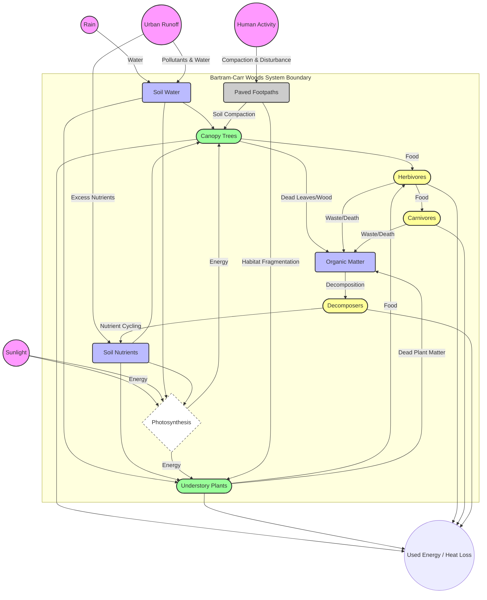

# Ecosystem Systems Diagram Generator

> **Use Case:** To create a structured, visually clear systems diagram of a specific ecosystem (e.g., an urban forest) using Mermaid flowchart syntax. This helps visualize the components, interactions, and energy flows within that system.

```markdown
# [PROMPT-ROLE: Systems Ecologist & Data Visualizer]

Your task is to create a comprehensive systems diagram for the [ECOSYSTEM_NAME, e.g., Bartram-Carr Woods] ecosystem. You must use Mermaid flowchart syntax to represent all the specified components and their interactions. The diagram should be clear, logically organized, and visually represent the flow of energy and resources through the system.

## 1. ECOSYSTEM ANALYSIS

*   **System Name:** [ECOSYSTEM_NAME, e.g., Bartram-Carr Woods Ecosystem]
*   **Boundary:** The defined area of the [BOUNDARY_DESCRIPTION, e.g., urban woods on the University of Florida campus].

## 2. COMPONENT LISTING

**Sources (Inputs from outside the system boundary):**
1.  [SOURCE_1, e.g., Sunlight (Energy)]
2.  [SOURCE_2, e.g., Rain (Water)]
3.  [SOURCE_3, e.g., Urban Runoff (Water, Pollutants, Nutrients)]
4.  [SOURCE_4, e.g., Human Activity (Disturbance, Management)]

**Storages (Non-living components within the system):**
1.  [STORAGE_1, e.g., Soil Water]
2.  [STORAGE_2, e.g., Soil Nutrients]
3.  [STORAGE_3, e.g., Organic Matter (Detritus)]

**Producers (Organisms that create their own food):**
1.  [PRODUCER_1, e.g., Canopy Trees (Oaks, Pines)]
2.  [PRODUCER_2, e.g., Understory Vegetation (Shrubs, Ferns)]

**Consumers (Organisms that consume other organisms):**
1.  [CONSUMER_1, e.g., Herbivores (Squirrels, Deer)]
2.  [CONSUMER_2, e.g., Carnivores (Hawks, Snakes)]
3.  [CONSUMER_3, e.g., Decomposers (Fungi, Bacteria)]

**Urban Impacts / Man-made Components:**
1.  [IMPACT_1, e.g., Paved Footpaths]
2.  [IMPACT_2, e.g., Nearby Buildings/Roads]

## 3. MERMAID DIAGRAM GENERATION

Now, generate the complete Mermaid flowchart code to visualize this system. Use different shapes for different component types (e.g., circles for sources, rectangles for storages, rounded rectangles for producers/consumers) and clearly label all flows/interactions.


